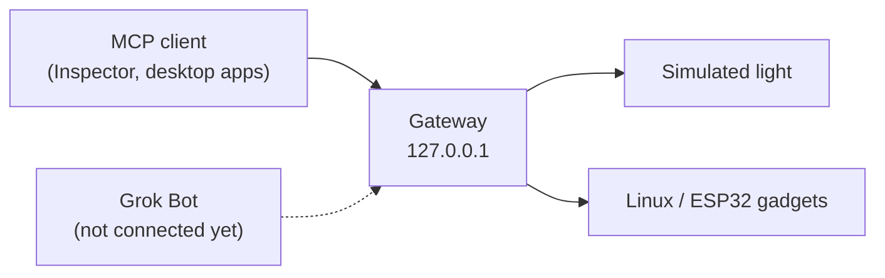

# Grok Gadgets gateway

A local MCP server that lets MCP clients today, and your Grok Bot later, list and control
gadgets: a built-in simulated light, Linux gadgets and ESP32 devices. Experimental alpha: Grok Bot and
hardware are not verified yet ([project status](https://grok-gadgets.pages.dev/doc-docs-public-support-matrix)).
Independent project, not affiliated with SpaceXAI or xAI.

## Quick start

Needs Git and [uv](https://docs.astral.sh/uv/getting-started/installation/).

```sh
git clone https://github.com/adidshaft/grok-gadgets-gateway.git
cd grok-gadgets-gateway
uv sync --locked
uv run grok-gadgets-gateway init
uv run grok-gadgets-gateway serve --simulator
```

`init` prints pasteable MCP client settings. Then call the tools from MCP Inspector:
[first success in five minutes](docs/first-success.md).

## How it works



The gateway gives any MCP client six tools:

| Tool | What it does |
| --- | --- |
| `gadgets_list_devices` | Lists gadgets, their commands and what each one does. Call it first. |
| `gadgets_get_state` | Reads a gadget's last reported state and how fresh it is. |
| `gadgets_command` | Sends a command and waits up to 3 seconds for the result. |
| `gadgets_command_status` | Reads the result of a slower command later. |
| `gadgets_read_events` | Reads button presses and other events in order. |
| `gadgets_diagnostics` | A support report with no tokens, state or arguments. |

A result is the gadget's own report, not proof of a physical effect.

## Connect a gadget

`init` prints two settings blocks with absolute paths: one where your MCP client starts the
gateway (`stdio`), and one for a running `serve` (`http://127.0.0.1:8766/mcp` with the bearer
token from `~/.config/grok-gadgets/mcp-token`). `init --client http` prints just one.

Gadgets connect to `127.0.0.1:8765` with their own token:

```sh
uv run grok-gadgets-gateway enroll desk-lamp --token-file desk-lamp.token
```

`enroll desk-lamp --rotate` issues a new token for the same gadget. Write gadgets with the
[Linux SDK](https://github.com/adidshaft/grok-gadgets-linux-sdk) or the
[ESP32 SDK](https://github.com/adidshaft/grok-gadgets-esp32-sdk); the Linux SDK's `dev`
command needs no token at all. Both ports are loopback only.

## Grok Bot today

A cloud Grok Bot cannot open `127.0.0.1` on your computer, so today the gateway works with
local MCP clients. A supported remote route is later work
([HARD-GROK-REMOTE-001](https://github.com/adidshaft/grok-gadgets/issues/4)). `serve` is not an
OAuth server, and a tunnel does not replace the bearer token. Never expose port 8765. Read
[remote access](docs/remote-access.md) and [security](SECURITY.md) first.

## Troubleshooting

| Symptom | Next step |
| --- | --- |
| Not sure which command | Run `grok-gadgets-gateway --help`. Use `serve` for a long-running process; `stdio` is for an MCP client that starts the gateway itself. |
| No simulated light | Start with `--simulator`. |
| `401` from the client | Send `Authorization: Bearer <token>` with the exact contents of the token file. |
| Config rejected | Use strict v1 JSON within the [documented bounds](docs/simulator.md). |
| Command still `accepted` or `dispatched` | The gadget is slow. Poll `gadgets_command_status`; never resend with a new command ID. |

## Learn more

- [First success with MCP Inspector](docs/first-success.md) and the [simulator guide](docs/simulator.md)
- [Local operation](docs/local-operation.md), [architecture](docs/architecture.md) and [protocol 0.1.0](protocol/0.1.0/README.md)
- Demo without HTTP: `uv run python -m grok_gadgets_gateway.demo` (uses test-only controls)
- Shared docs and the website: [hub repository](https://github.com/adidshaft/grok-gadgets) and <https://grok-gadgets.pages.dev/>

## Community

Questions, build photos and ideas are welcome on
[r/GrokGadgets](https://www.reddit.com/r/GrokGadgets/). Report bugs and request features in
[GitHub Issues](https://github.com/adidshaft/grok-gadgets-gateway/issues). New here? Pick a
[good first issue](https://github.com/adidshaft/grok-gadgets-gateway/issues?q=is%3Aissue+is%3Aopen+label%3A%22good+first+issue%22)
and read [CONTRIBUTING](CONTRIBUTING.md). Get help: [SUPPORT](SUPPORT.md).

## License and affiliation

Apache-2.0; see [LICENSE](LICENSE) and [NOTICE](NOTICE). Grok Gadgets is an independent
open-source project. It is **not affiliated with, endorsed by or sponsored by SpaceXAI or
xAI**, which make Grok and Grok Bot. Pre-publication commit dates were reconstructed; see the
[history record](https://github.com/adidshaft/grok-gadgets/blob/main/docs/verification/publication-sanitization.md).
