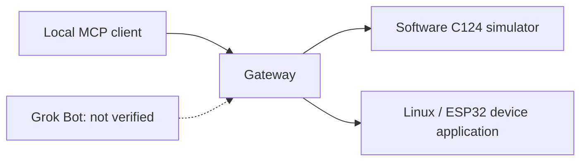

# Grok Gadgets gateway

This gateway is a local MCP server for Grok Gadgets. It lists gadget capabilities, sends commands, and reports state and events. It includes a software C124 simulator. The project is exclusively for Grok and is experimental alpha software.

## What works with Grok Bot today

A software simulator can run inside a Grok Bot cloud computer as the stdio process `grok-gadgets-gateway --simulator`. A gadget on a Mac or Raspberry Pi needs `serve` on that computer and an HTTPS tunnel that you operate to `http://127.0.0.1:8766/mcp`. That loopback service is implemented and tested here with the official MCP client. It has not been verified with Grok Bot. Physical hardware has not been verified. A device acknowledgement is a report, not proof of a physical effect.

## Quick start

1. Run `uv sync --locked`.
2. Run `uv run grok-gadgets-gateway init`.
3. Run `uv run grok-gadgets-gateway serve --simulator`.

The MCP URL is `http://127.0.0.1:8766/mcp`. The bearer token is the single line in `~/.config/grok-gadgets/mcp-token` (mode 0600). Send `Authorization: Bearer <token>`. The device listener is `127.0.0.1:8765`. Both sockets are loopback only.

For a real device id, run `uv run grok-gadgets-gateway enroll <device-id>` and give the printed `GROK_GADGETS_DEVICE_TOKEN` to that device once. Read [remote access](docs/remote-access.md) before you put anything on the network.



Solid lines show local software interfaces. A device acknowledgement reports execution.
It does not prove a physical effect. Observe the device separately.
The simulator has no physical effects and makes no Grok API calls.

## Choose a first step

- **Try without hardware:** run the installed MCP demonstration below.
- **Customize:** use the [simulator guide](docs/simulator.md) and a separate `my-light.json`.
- **Connect your application:** read [local operation](docs/local-operation.md) and the
  [versioned protocol](protocol/0.1.0/README.md).
- **Contribute:** use [CONTRIBUTING](CONTRIBUTING.md), [support](SUPPORT.md), and
  [GitHub Issues](https://github.com/adidshaft/grok-gadgets-gateway/issues).

## Run the installed demonstration

`serve` keeps running without an MCP client. A local MCP client can still launch the stdio process with `grok-gadgets-gateway --simulator`. `--test-controls` exists only on that stdio process. HTTP mode does not expose test controls.

You need uv, Python 3.11, and the gateway wheel. Tests used native Apple Silicon
Python 3.11.15. Installation can require network access.
The simulator needs no account, API key, or hardware.

Package releases are not published. Build a wheel from this source checkout:

1. Run `uv sync --locked`.
2. Run `uv build`.
3. Copy `grok_gadgets_gateway-0.1.0a1-py3-none-any.whl` to an empty working folder.
4. Open a terminal in that folder.
5. Run these commands:

```sh
uv venv --python 3.11 --seed .venv
.venv/bin/python -m pip install ./grok_gadgets_gateway-0.1.0a1-py3-none-any.whl
.venv/bin/python -m grok_gadgets_gateway.demo
```

The official local MCP client starts the gateway as a child process.
The demo checks discovery, green RGB, state readback, retries, and invalid-command rejection.
It also checks simulated button transitions, offline failure, and reconnection.
The final JSON includes:

```json
{"led_status": "executed", "simulated": true, "physical_verified": false, "grok_verified": false}
```

This example shows part of the report. It is not a native Grok receipt.
The demo enables test controls only in its child simulator.

An ordinary local MCP client launches:

```sh
.venv/bin/grok-gadgets-gateway --simulator
```

Use the absolute executable path in the client configuration. The client manages
the process. The process uses MCP on stdio and waits for requests.
It does not provide an interactive terminal. The standard tools are `gadgets_list_devices`, `gadgets_get_state`,
`gadgets_command`, `gadgets_command_status`, `gadgets_read_events`, and
`gadgets_diagnostics`. `--test-controls` is a separate explicit opt-in.

## Compatibility and evidence

Package `0.1.0a1` and protocol `0.1.0` are separate version identifiers.
The package declares Python `>=3.11` support. We have not tested every interpreter or platform.

| Path | Evidence | Remaining limit |
| --- | --- | --- |
| macOS arm64, CPython 3.11.15 | Source checks and fresh installed-wheel MCP demo | Independent human reproduction |
| Linux aarch64, CPython 3.11.17 container | Gateway domain/TCP used in recorded Linux SDK acceptance | Standalone gateway MCP/platform matrix |
| Simulator | Configured identity, RGB, delay, offline/reconnect | No physical device |
| Device TCP / USB framing | Authenticated loopback and software pseudo-terminal checks | Physical cable, board, and OS permissions |
| `serve` on 127.0.0.1:8766/mcp | Local bearer-token Streamable HTTP tests, including a simulator command | Not a Grok Bot session; you supply HTTPS |
| Windows / Intel Mac | Not verified | Clean installation and runtime tests |
| Grok / mobile / C124 | Not verified | A supported client route and observed hardware |

[Launch verification](docs/verification/launch-docs.md) records the documented quick
start. [Simulator evidence](docs/verification/simulator-config.md) and
[historical alpha checks](docs/evidence/local-alpha.md) retain their actual scopes.

## Architecture and boundaries

This repository owns the gateway, simulator, and canonical schemas. Device libraries
belong in the [Linux SDK](https://github.com/adidshaft/grok-gadgets-linux-sdk) and
[ESP32 SDK](https://github.com/adidshaft/grok-gadgets-esp32-sdk). Shared architecture,
roadmap, and policies live in the [hub](https://github.com/adidshaft/grok-gadgets).
The demo needs no sibling checkout.

Device TCP binds to loopback only and requires per-device credentials outside Git.
`serve` also binds Streamable HTTP MCP to `127.0.0.1:8766/mcp` and checks a bearer token.
A cloud Bot cannot open that loopback port by itself. Run `serve` on the gadget host.
If you publish an HTTPS URL, follow [remote access](docs/remote-access.md). Do not expose port 8765.
The public project website serves documentation and downloads; it does not run your gateway.

There is no OAuth server in this package. The HTTP check is the static bearer token from
`mcp-token`. A tunnel can provide reachability. It does not replace that token, and it is
not Grok Bot verification. See
[HARD-GROK-REMOTE-001](https://github.com/adidshaft/grok-gadgets/issues/4) and the
[hosting FAQ](https://github.com/adidshaft/grok-gadgets/blob/main/docs/getting-started/hosting.md),
plus [architecture](docs/architecture.md), [security](SECURITY.md), and
[release preparation](docs/release.md).

## Troubleshooting and support

| Symptom | Next step |
| --- | --- |
| Server waits silently | For stdio, launch through an MCP client. For a long-running process, use `serve`. |
| No simulated device | Include `--simulator`; a config alone does not enable it. |
| Config rejected | Use strict v1 JSON and the [documented bounds](docs/simulator.md). |
| Dependency installation fails | Use the selected Python 3.11 environment above; another system interpreter/architecture is not the verified baseline. |
| Device unavailable | Inspect state; reconnect explicitly in a test session or diagnose the agent. |
| Unconfirmed / timed out | Inspect state and recover safely; never invent a new retry ID for an uncertain physical action. |

Use [SUPPORT](SUPPORT.md), [SECURITY](SECURITY.md), and
[CODE_OF_CONDUCT](CODE_OF_CONDUCT.md). Do not post credentials, household state,
private event bodies, or raw account captures in issues.

Original code is [Apache-2.0](LICENSE); retain [NOTICE](NOTICE) and installed dependency
licenses. This independent project is exclusively for Grok and is not affiliated with xAI.

## History note

Pre-publication commit dates were reconstructed across 29 September–5 October 2026 at the owner’s request. Verification records retain their actual execution dates. See the [history and privacy record](https://github.com/adidshaft/grok-gadgets/blob/main/docs/verification/publication-sanitization.md).
