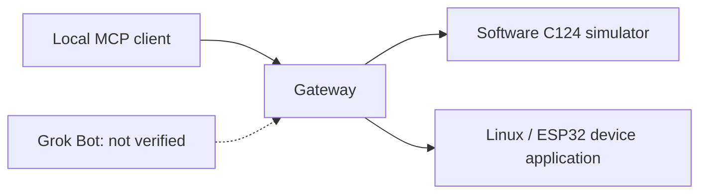

# Grok Gadgets gateway

A local MCP server to connect your existing Grok Bot to gadgets. It lists capabilities, sends commands, and reports state and events. It includes a software C124 simulator. Experimental alpha; the Grok Bot connection remains unverified.

## What works with Grok Bot today

| You can do this now | You cannot do this yet |
| --- | --- |
| Run a local MCP client against this gateway. | Treat a local test as a Grok Bot session. |
| Run `serve` on `http://127.0.0.1:8766/mcp` with a file bearer token. | Point Grok Bot at `127.0.0.1`. A cloud Bot cannot open that port. |
| Put your own HTTPS in front of `serve`. | Claim that path is verified. No Grok Bot or hardware check exists here. |

A device acknowledgement is a report, not proof of a physical effect. Button events do not wake Grok Bot.

## Quick start

```sh
uv sync --locked
uv run grok-gadgets-gateway init
uv run grok-gadgets-gateway serve --simulator
```

Then call the tools from MCP Inspector: [first success in five minutes](docs/first-success.md).

`init` prints two pasteable MCP client settings blocks with absolute paths: one where your client starts the gateway (`stdio`), one for the running `serve`. `init --client http` prints just one. The MCP URL is `http://127.0.0.1:8766/mcp`. The bearer token is the single line in `~/.config/grok-gadgets/mcp-token` (mode 0600). Devices listen on `127.0.0.1:8765`. Both sockets are loopback only.

For a real device id: `uv run grok-gadgets-gateway enroll <device-id>`, then give that device the printed `GROK_GADGETS_DEVICE_TOKEN` once. Read [remote access](docs/remote-access.md) before you put anything on the network.

Optional local demo (stdio child, no HTTP):

```sh
uv run python -m grok_gadgets_gateway.demo
```

The demo uses `--test-controls`. HTTP `serve` does not expose them.



## Next

- Customize the simulator: [simulator guide](docs/simulator.md)
- Connect a gadget: [local operation](docs/local-operation.md) and [protocol 0.1.0](protocol/0.1.0/README.md)
- HTTPS in front of `serve`: [remote access](docs/remote-access.md)
- Contribute: [CONTRIBUTING](CONTRIBUTING.md), [support](SUPPORT.md), [issues](https://github.com/adidshaft/grok-gadgets-gateway/issues)

Standard tools: `gadgets_list_devices`, `gadgets_get_state`, `gadgets_command`, `gadgets_command_status`, `gadgets_read_events`, `gadgets_diagnostics`.

This repository owns the gateway, simulator, and canonical schemas. Device libraries live in the [Linux SDK](https://github.com/adidshaft/grok-gadgets-linux-sdk) and [ESP32 SDK](https://github.com/adidshaft/grok-gadgets-esp32-sdk). Shared docs live in the [hub](https://github.com/adidshaft/grok-gadgets).

There is no OAuth server. A tunnel moves packets; it does not replace the bearer token. Do not expose port 8765. See [HARD-GROK-REMOTE-001](https://github.com/adidshaft/grok-gadgets/issues/4), [hosting FAQ](https://github.com/adidshaft/grok-gadgets/blob/main/docs/getting-started/hosting.md), [architecture](docs/architecture.md), and [security](SECURITY.md).

| Symptom | Next step |
| --- | --- |
| Not sure which command | Run `grok-gadgets-gateway --help`. `stdio` is for an MCP client that starts the gateway itself; use `serve` for a long-running process. |
| No simulated device | Pass `--simulator`. |
| Config rejected | Use strict v1 JSON and the [documented bounds](docs/simulator.md). |
| Unconfirmed / timed out | Inspect state. Do not invent a new command ID for an uncertain physical action. |

Apache-2.0. Not affiliated with xAI. Pre-publication commit dates were reconstructed; verification records keep their real dates. See the [history record](https://github.com/adidshaft/grok-gadgets/blob/main/docs/verification/publication-sanitization.md).
