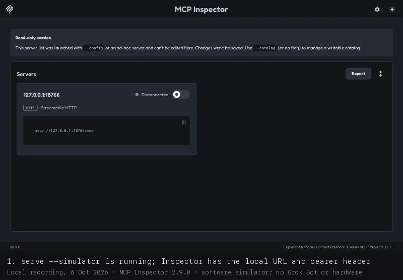

# First success in five minutes

Run the gateway with its simulated light, then drive it from
[MCP Inspector](https://github.com/modelcontextprotocol/inspector), the official MCP developer tool.
No model, hardware, account or API key is involved.

You need Git, [uv](https://docs.astral.sh/uv/getting-started/installation/) and Node.js 22 or later.



## 1. Start the gateway

```sh
git clone https://github.com/adidshaft/grok-gadgets-gateway.git
cd grok-gadgets-gateway
uv sync --locked
uv run grok-gadgets-gateway init
uv run grok-gadgets-gateway serve --simulator
```

Leave it running. It serves MCP on `http://127.0.0.1:8766/mcp` and accepts only the bearer
token that `init` wrote to `~/.config/grok-gadgets/mcp-token`.

## 2. Open MCP Inspector

In a second terminal:

```sh
npx @modelcontextprotocol/inspector@2.9.0 --web --transport http \
  --server-url http://127.0.0.1:8766/mcp \
  --header "Authorization: Bearer $(cat ~/.config/grok-gadgets/mcp-token)"
```

Open the printed `http://127.0.0.1:6274?...` link. Turn on the switch next to
`127.0.0.1:8766`. It shows **Connected**.

## 3. Call the tools

1. Open **Tools**. You see six tools, from `gadgets_list_devices` to `gadgets_diagnostics`.
2. Select `gadgets_list_devices` and press **Execute Tool**. The simulated light `sim-c124`
   ("Desk light") is listed with `"simulated": true`.
3. Select `gadgets_command`, turn on **Edit as JSON**, and enter:

   ```json
   {"device_id": "sim-c124", "capability": "rgb.set", "arguments": {"r": 0, "g": 120, "b": 255, "on": true}}
   ```

   Press **Execute Tool**. The reply has `"status": "executed"`, `"simulated": true` and
   `"physical_verified": false`.
4. Optional: `gadgets_get_state` with `{"device_id": "sim-c124"}` shows the new colour.

## Without a browser

The same Inspector has a command-line mode:

```sh
TOKEN="$(cat ~/.config/grok-gadgets/mcp-token)"
npx @modelcontextprotocol/inspector@2.9.0 --cli http://127.0.0.1:8766/mcp --transport http \
  --header "Authorization: Bearer $TOKEN" --method tools/call --tool-name gadgets_command \
  --tool-args-json '{"device_id":"sim-c124","capability":"rgb.set","arguments":{"r":0,"g":120,"b":255,"on":true}}'
```

## What this proves

The gateway, the simulator and the six MCP tools work in a standard MCP client on your
computer. It does not prove a Grok Bot connection or any physical effect.

CI runs this path from a clean checkout on every push and every night:
[`scripts/check_first_success.py`](../scripts/check_first_success.py) reads the commands from
the README quick start, then calls the tools with the Inspector command line.

## If something fails

| Symptom | Next step |
| --- | --- |
| `401` or Inspector cannot connect | The header must be `Authorization: Bearer <token>` with the exact file contents. |
| Port 8766 or 8765 in use | Stop the other process, or pass `--port` and `--device-port` to `serve` and change the URL. |
| No `sim-c124` | Start `serve` with `--simulator`. |
| `npx` not found | Install Node.js 22 or later. |
